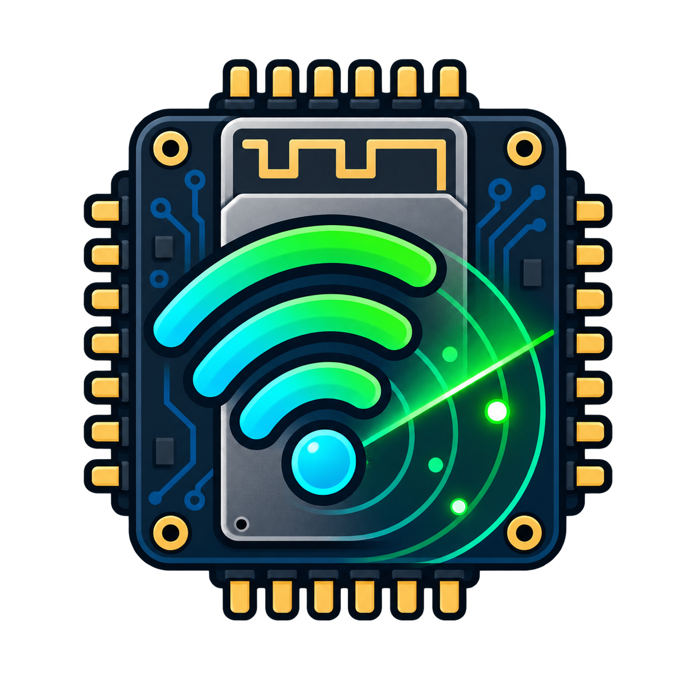

<div align="center">
  

  # ESP32 WiFi Scanner

  **A portable 2.4 GHz Wi-Fi analyzer for the ESP32-2432S028R Cheap Yellow Display.**

  
  
  [](https://github.com/fgrfn/ESP32-WiFi-Scanner/actions/workflows/compile.yml)
  
</div>

ESP32 WiFi Scanner turns the inexpensive ESP32-2432S028R—commonly known as the
Cheap Yellow Display or CYD—into a self-contained wireless survey tool. It scans
nearby networks, compares access points, tracks signal history, evaluates
2.4 GHz channel congestion, logs CSV data, and serves a local web dashboard.

> [!IMPORTANT]
> The classic ESP32 radio detects 2.4 GHz Wi-Fi only. It cannot see 5 GHz or
> 6 GHz networks and is not a substitute for a spectrum analyzer.

## Features

- German/English first-boot language selection followed by touch calibration
- Paged network list with scrolling SSIDs and optional SSID grouping
- Mesh and multi-AP comparison by BSSID
- RSSI, signal quality, channel, encryption, and offline vendor identification
- 45-sample signal graph with minimum, maximum, average, outages, and channel changes
- Weighted channel analysis with recommendations for channels 1, 6, and 11
- Security overview with an open-network warning
- Persistent NVS settings and tracked-network history
- Dark/light themes and 25%, 50%, 75%, and 100% brightness levels
- Active-low RGB status LED
- Optional SD card logging with controlled touch/SD SPI bus switching
- Responsive local dashboard with charts, settings, and CSV downloads
- Browser-based local time synchronization
- Confirmation-protected factory reset

## First boot

```text
Power on
   ↓
Select Deutsch or English
   ↓
Touch the upper-left calibration target
   ↓
Touch the lower-right calibration target
   ↓
Automatic Wi-Fi scanning starts
```

Language and calibration are stored in NVS. Language can later be changed under
**SET → MORE 2/2 → Language**. A factory reset clears both and repeats the
first-boot sequence.

## Hardware

The primary target is the classic ESP32 version of the ESP32-2432S028R.

| Component | Specification |
|---|---|
| MCU | Classic ESP32 |
| Display | ILI9341, 240 × 320 pixels |
| Touch | XPT2046 resistive controller |
| Status LED | On-board active-low RGB LED |
| Storage | Optional microSD card |
| Wi-Fi | 2.4 GHz 802.11 b/g/n |

### Pinout

| Function | GPIO | Function | GPIO |
|---|---:|---|---:|
| TFT MISO | 12 | Touch SCLK | 25 |
| TFT MOSI | 13 | Touch MISO | 39 |
| TFT SCLK | 14 | Touch MOSI | 32 |
| TFT CS | 15 | Touch CS | 33 |
| TFT DC | 2 | Touch IRQ | 36 |
| TFT backlight | 21 | SD SCLK | 18 |
| SD MISO | 19 | SD MOSI | 23 |
| SD CS | 5 | BOOT button | 0 |
| RGB red | 4 | RGB green | 16 |
| RGB blue | 17 | | |

> [!WARNING]
> Touch and SD use the same ESP32 SPI controller on different pins. The firmware
> intentionally switches the bus before and after SD access. Do not remove or
> parallelize that sequence without testing on real hardware.

## Requirements

| Dependency | Version |
|---|---:|
| ESP32 Arduino core | `3.3.11` |
| TFT_eSPI | `2.5.43` |
| XPT2046_Touchscreen | `1.4` |
| Board/FQBN | `esp32:esp32:esp32` |

The project-local `tft_setup.h` is preloaded through `build_opt.h`, so the
installed TFT_eSPI library does not need to be edited.

## Installation

### Arduino IDE

1. Install **esp32 by Espressif Systems** version `3.3.11` in Boards Manager.
2. Install `TFT_eSPI` `2.5.43` and `XPT2046_Touchscreen` `1.4` in Library Manager.
3. Open `ESP32_WiFi_Scanner/ESP32_WiFi_Scanner.ino`.
4. Select **ESP32 Dev Module** and the correct serial port.
5. Click **Verify**, then **Upload**.

If the upload cannot connect, hold the BOOT button while the IDE begins
connecting, then release it.

### Arduino CLI

```sh
arduino-cli core update-index
arduino-cli core install esp32:esp32@3.3.11
arduino-cli lib install TFT_eSPI@2.5.43
arduino-cli lib install XPT2046_Touchscreen@1.4
arduino-cli compile --fqbn esp32:esp32:esp32 ESP32_WiFi_Scanner
```

See [Installation](docs/installation.md) for the full setup and the critical
ESP32 Core 3.3.11 include-order explanation.

## Device controls

| Screen or control | Action |
|---|---|
| Network list | Tap a network to open signal details |
| LIST | Advance to the next result page |
| Horizontal swipe | Move between result pages |
| CHANNEL | Open weighted channel analysis |
| SECURITY | Open the encryption overview |
| AP LIST | Compare BSSIDs advertising the selected SSID |
| SET | Open persistent device settings |
| PAUSE / BOOT | Pause or resume scanning |

The detail view displays BSSID, vendor, channel, security, RSSI, quality,
minimum, maximum, average, outages, channel changes, and signal history.

## Settings

| Page 1 | Page 2 |
|---|---|
| Scan interval | Clock synchronization state |
| SSID grouping | Scan age |
| Hidden networks | Saved history size |
| Brightness: 25/50/75/100% | Channel changes |
| Dark/light theme | German/English language |
| SD CSV logging | Factory reset |
| Web dashboard | Dashboard address |
| Touch recalibration | Firmware version |

## Web dashboard

Enable **Web Dashboard** in device settings, then connect a phone or computer:

| Setting | Value |
|---|---|
| Wi-Fi network | `ESP32-WiFi-Scanner` |
| Password | `scanner1234` |
| Address | `http://192.168.4.1` |

The access point is local and does not provide internet access. The dashboard
follows the selected language and can change language, scan interval, grouping,
hidden-network visibility, display theme, SD logging, and brightness. It also
provides live channel/security charts and CSV downloads.

Opening the dashboard sends the browser's current local time to the ESP32. The
board has no real-time clock, so synchronization must be repeated after every
restart. Before synchronization, log timestamps use `U+seconds` since boot.

## SD logging

When enabled, the firmware creates:

- `/wifi-scanner.csv` — one row per detected BSSID after each scan
- `/wifi-history.csv` — one row per scan for the selected BSSID

See [SD logging and CSV formats](docs/sd-logging.md) for headers and behavior.

## RGB status LED

| Color | Meaning |
|---|---|
| Blue | Scan running |
| Green | Scan complete; no open network found |
| Yellow | At least one open network detected |
| Red | Scanning paused |

## Verified build

The current firmware compiles without warnings for `esp32:esp32:esp32` with the
pinned dependencies above. The latest local verification result is documented
in [BUILD_REPORT.md](BUILD_REPORT.md). GitHub Actions repeats the same pinned
compile on every push and pull request.

## Project structure

```text
esp32-wifi-scanner/
├── ESP32_WiFi_Scanner/
│   ├── ESP32_WiFi_Scanner.ino
│   ├── build_opt.h
│   └── tft_setup.h
├── docs/
├── images/
│   └── logo.png
├── .github/
│   ├── ISSUE_TEMPLATE/
│   └── workflows/
├── ATTRIBUTION.md
├── BUILD_REPORT.md
├── CHANGELOG.md
├── CONTRIBUTING.md
└── README.md
```

## Known limitations

- The classic ESP32 detects 2.4 GHz Wi-Fi only.
- Channel recommendations model Wi-Fi overlap and RSSI, not non-Wi-Fi noise.
- The device has no RTC; real timestamps require browser synchronization after reboot.
- Scans retain the 30 strongest detected networks.
- Vendor identification uses a small offline OUI table and may report unknown devices.
- CYD boards exist in several hardware revisions with different display behavior.

## Documentation

- [Hardware and pinout](docs/hardware.md)
- [Installation and flashing](docs/installation.md)
- [Display interface](docs/display-ui.md)
- [Web dashboard](docs/web-dashboard.md)
- [SD logging and CSV formats](docs/sd-logging.md)
- [Troubleshooting](docs/troubleshooting.md)
- [Release checklist](docs/release-checklist.md)
- [License options](docs/licensing.md)

## Origin and attribution

The initial concept and code basis came from Marco's
[WIFI ANALIZER - ESP32 LVGL 2432S028 2.8\"](https://makerworld.com/de/models/2303837-wifi-analizer-esp32-lvgl-2432s028-2-8#profileId-2514600),
which also provides a matching printable enclosure. This repository does not
redistribute the enclosure files. See [ATTRIBUTION.md](ATTRIBUTION.md) for the
complete provenance and publication requirements.

## License status

License selection is intentionally pending. Public release must wait until the
original Arduino code's redistribution terms—or explicit permission from its
creator—have been confirmed. See [License options](docs/licensing.md).
